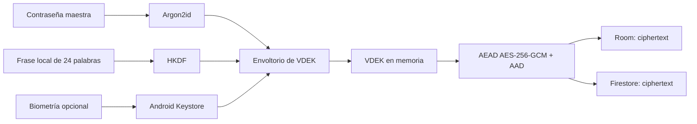

# Bóveda Wilson

Aplicación Android nativa para guardar notas, credenciales y datos sensibles con un modelo de conocimiento cero. El contenido se cifra en el dispositivo antes de llegar al almacenamiento local o a Firebase; el servicio remoto recibe ciphertext y metadatos mínimos, no el contenido de la bóveda.

> **Estado:** código fuente público del MVP Android. La aplicación fue validada en un dispositivo físico, pero este repositorio no distribuye APKs ni material de firma. El alcance verificable y las limitaciones se mantienen en [PROJECT_STATE.md](PROJECT_STATE.md).

## Capacidades

- Bóveda local cifrada y sincronización de ciphertext con Firestore.
- Notas, credenciales, etiquetas y campos personalizados.
- Contraseña maestra independiente de la cuenta de Google y del bloqueo del teléfono.
- Recuperación local mediante una frase de 24 palabras generada en el dispositivo.
- Desbloqueo biométrico opcional con Android Keystore; no sustituye a la contraseña ni a la recuperación.
- Bloqueo automático, bloqueo al pasar a segundo plano, respaldo cifrado y restauración defensiva.
- Sin analítica, publicidad, rastreo, grabación de sesión ni informes remotos de fallos en flujos sensibles.

## Seguridad en síntesis



La contraseña maestra, la frase de recuperación y la VDEK sin envolver no se almacenan ni se transmiten. Perder la contraseña **y** las 24 palabras implica perder el acceso a los datos de forma definitiva. Los límites y riesgos residuales están en [SECURITY.md](SECURITY.md) y [THREAT_MODEL.md](THREAT_MODEL.md).

## Arquitectura y diagramas

La interfaz Compose vive en `:app`; la sincronización y los casos de uso en `:data:sync`; el almacenamiento local y remoto manejan únicamente el tipo opaco `Ciphertext`; y el núcleo criptográfico no conoce Firebase, Room ni UI.

- [Mapa de módulos y dependencias](docs/diagrams/architecture.md)
- [Flujo de datos y ciclo de claves](docs/diagrams/data-and-keys.md)
- [Flujos de desbloqueo, sincronización y respaldo](docs/diagrams/workflows.md)
- [Arquitectura detallada](docs/architecture.md)
- [Recorrido de datos](docs/data-flow.md)
- [Ciclo de vida de claves](docs/key-lifecycle.md)
- [Protocolo de sincronización](docs/sync-protocol.md)

## Desarrollo local

Requisitos: JDK 17, Android SDK 36 y Node 22 para las reglas de Firestore. El wrapper fija Gradle; no hace falta instalarlo globalmente.

```powershell
.\gradlew.bat test lint detekt assembleDebug

Push-Location firebase
npm ci
npm test
Pop-Location
```

Las pruebas instrumentadas requieren un dispositivo o emulador autorizado:

```powershell
.\gradlew.bat connectedDebugAndroidTest
```

El desarrollo usa Firebase Emulator Suite. El repositorio no contiene configuración real de Firebase, claves de firma, contraseñas, frases de recuperación, respaldos ni APKs.

## Compilación release local

Una APK release solo se compila cuando se proporciona, fuera del repositorio y de cualquier carpeta sincronizada:

1. `app/google-services.json` vigente y no versionado;
2. un archivo externo de propiedades de firma;
3. el almacén de firma privado del propietario.

```powershell
.\gradlew.bat :app:assembleRelease `
  '-Pboveda.signingProperties=C:\RUTA_PRIVADA\signing.properties'
```

No se distribuyen APKs debug, builds sin firma, archivos de configuración, almacenes de firma ni respaldos de usuarios. La guía completa está en [FIREBASE_SETUP.md](FIREBASE_SETUP.md) y la lista de release en [docs/release-checklist.md](docs/release-checklist.md).

## Documentación

| Tema | Documento |
|---|---|
| Estado verificable, pruebas y riesgos abiertos | [PROJECT_STATE.md](PROJECT_STATE.md) |
| Decisiones de arquitectura y criptografía | [DECISIONS.md](DECISIONS.md) |
| Contrato criptográfico | [CRYPTOGRAPHY.md](CRYPTOGRAPHY.md) |
| Modelo de amenazas y riesgos residuales | [THREAT_MODEL.md](THREAT_MODEL.md) |
| Garantías y límites para usuarios | [SECURITY.md](SECURITY.md) |
| Recuperación de 24 palabras | [RECOVERY.md](RECOVERY.md) |
| Formato de respaldo | [BACKUP_FORMAT.md](BACKUP_FORMAT.md) |
| Estrategia y matriz de pruebas | [docs/TEST_STRATEGY.md](docs/TEST_STRATEGY.md) |
| Dependencias y cadena de suministro | [docs/DEPENDENCY_POLICY.md](docs/DEPENDENCY_POLICY.md) |
| Evidencia de verificación y limitaciones | [docs/VERIFICATION_STATUS.md](docs/VERIFICATION_STATUS.md) |

## Contribuir y reportar seguridad

Lee [CONTRIBUTING.md](CONTRIBUTING.md) antes de modificar el proyecto. Para reportar una vulnerabilidad, sigue [SECURITY.md](SECURITY.md); no incluyas contenido real de bóvedas, frases, contraseñas, claves ni tokens.

## Licencia

Este proyecto se publica bajo la [licencia MIT](LICENSE).
