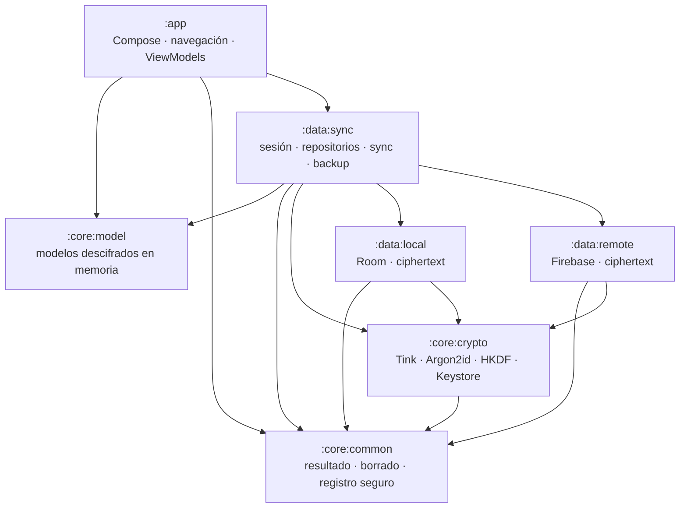

# Módulos y dependencias

**Versión:** 1.0 · **Actualizado:** 2026-08-17 · **Fuentes:** `settings.gradle.kts`, módulos Gradle y `docs/architecture.md`.

`app` no depende directamente de los adaptadores locales/remotos ni del núcleo criptográfico. `data:local` y `data:remote` no dependen de `core:model`: sus APIs persisten y transmiten `Ciphertext` opaco, no notas descifradas.
