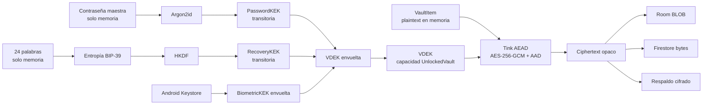

# Datos y ciclo de claves

**Versión:** 1.0 · **Actualizado:** 2026-08-17 · **Fuentes:** `CRYPTOGRAPHY.md`, `docs/data-flow.md` y `docs/key-lifecycle.md`.

El servidor puede ver identificadores aleatorios, versiones, tamaños y marcas de tiempo, pero no contenido descifrado. La biometría es local al dispositivo y no forma parte de Firestore ni del respaldo.
