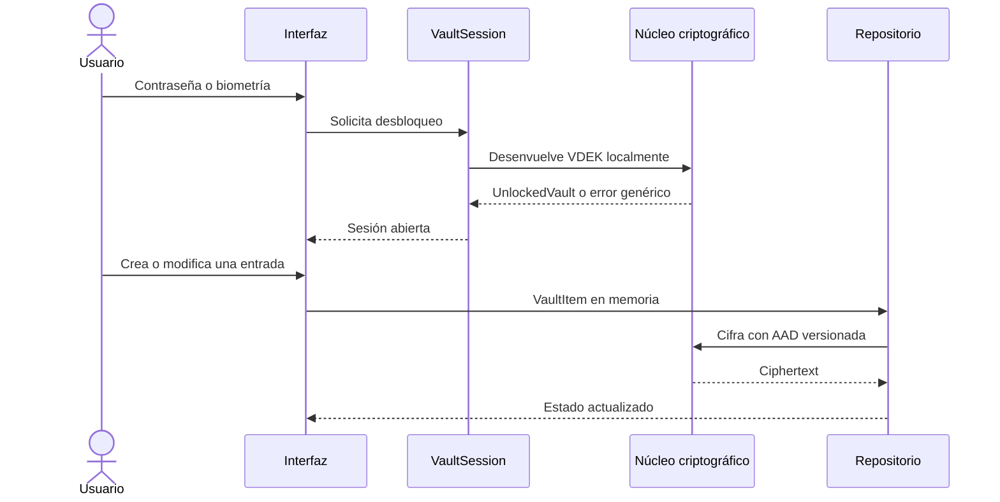
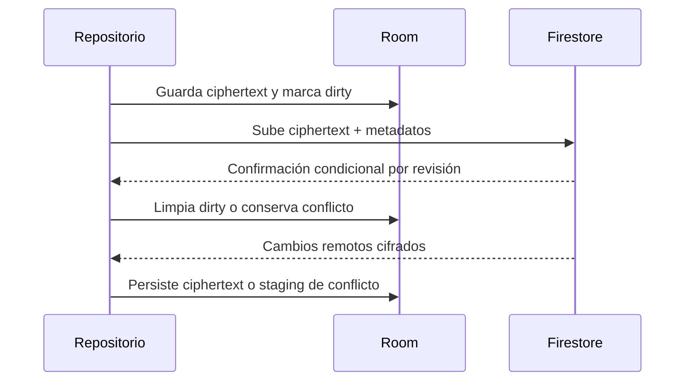
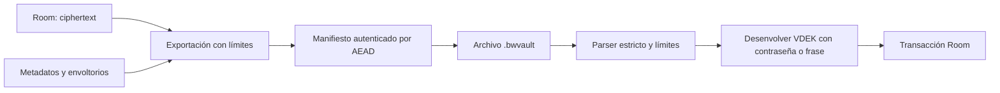

# Flujos operativos

**Versión:** 1.0 · **Actualizado:** 2026-08-17 · **Fuentes:** `docs/sync-protocol.md`, `BACKUP_FORMAT.md` y código de `:data:sync`.

## Desbloqueo y edición

## Sincronización local-first

## Respaldo y restauración

